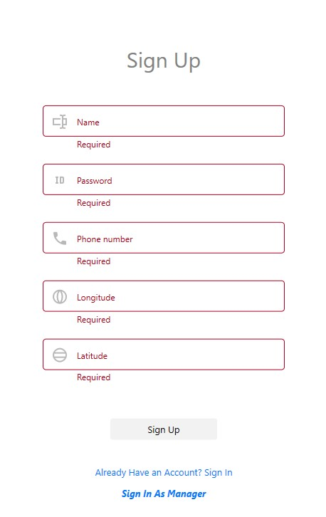
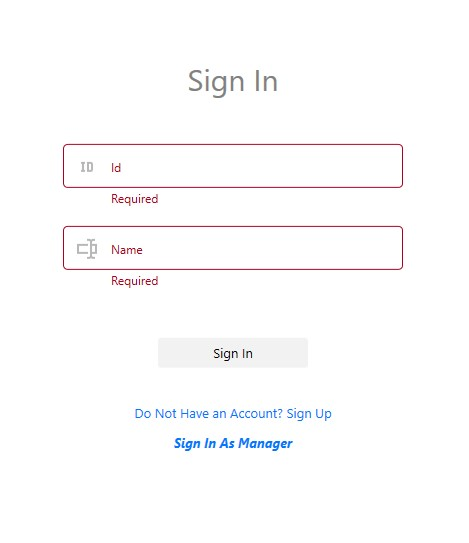
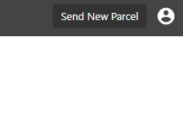
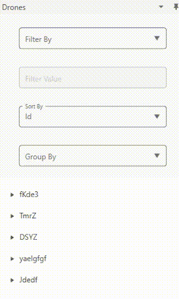
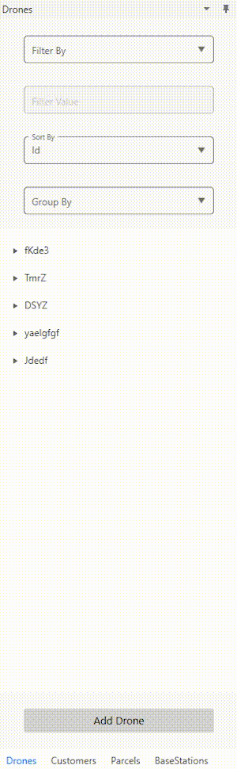
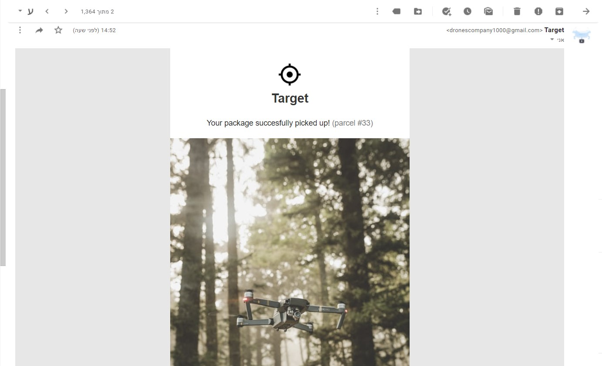
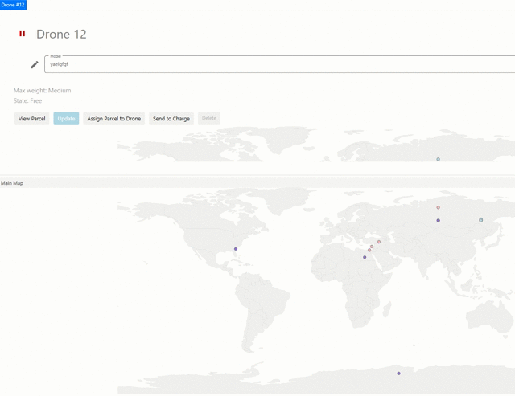
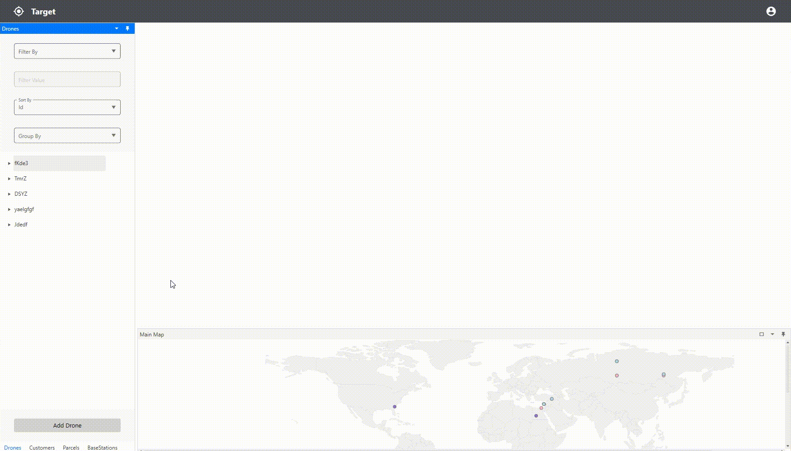
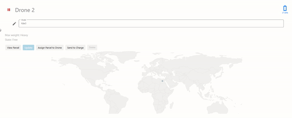
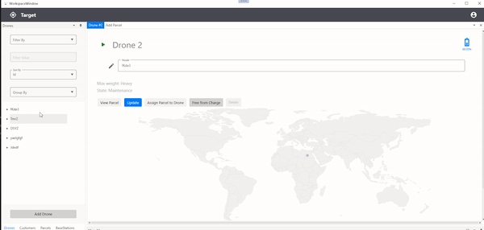

# dotNet5782_9171_7973
- [dotNet5782_9171_7973](#dotnet5782_9171_7973)
  - [Bonus Review](#bonus-review)
    - [General](#general)
      - [New c# Features](#new-c-features)
    - [Dal](#dal)
      - [Structure](#structure)
      - [Logic Deletion](#logic-deletion)
      - [Extensive Use of Generic](#extensive-use-of-generic)
    - [PL](#pl)
      - [Custom Window Layout - Docking](#custom-window-layout---docking)
      - [Regular Expression](#regular-expression)
      - [User Interface](#user-interface)
      - [Full Support of All Data Queries](#full-support-of-all-data-queries)
      - [MVVM](#mvvm)
        - [PO Entities](#po-entities)
      - [Custom `UserControl`](#custom-usercontrol)
      - [Miscellaneous](#miscellaneous)
      - [External dictionary](#external-dictionary)
      - [Automatic Mail Sending](#automatic-mail-sending)
    - [Simulator](#simulator)
      - [Location Update](#location-update)
      - [Parallel Activation](#parallel-activation)
      - [Busy Indicator](#busy-indicator)
      - [Application Closing Prevention](#application-closing-prevention)
      - [Maps](#maps)
    - [Design patterns](#design-patterns)
      - [Factory - Full structure](#factory---full-structure)
      - [Singleton](#singleton)
      - [Last But Not Least](#last-but-not-least)

## Bonus Review

### General
#### New c# Features
- [Record](https://github.com/dasizis/dotNet5782_9171_7973/blob/549b55c3dbb1381493c1e36a7aa49a9d8cca3464/dotNet5782_9171_7973/BL/BO/DroneSimulatorChanges.cs#L1)
- [Switch Expression](https://github.com/dasizis/dotNet5782_9171_7973/blob/b3326b502c4ef8df432f34f2dca4ba10b42f6404/dotNet5782_9171_7973/BL/BL/BL.cs#L211)
- [Tupples](https://github.com/dasizis/dotNet5782_9171_7973/blob/b3326b502c4ef8df432f34f2dca4ba10b42f6404/dotNet5782_9171_7973/BL/BL/BL.cs#L33)
- [Init Only Setters](https://github.com/dasizis/dotNet5782_9171_7973/blob/b3326b502c4ef8df432f34f2dca4ba10b42f6404/dotNet5782_9171_7973/BL/BL/BL.cs#L21)
- [Using Statement](https://github.com/dasizis/dotNet5782_9171_7973/blob/52a512db91d8e25589d7bedd44bb86eb4fbb7ad7/dotNet5782_9171_7973/DalXml/XSerialization.cs#L18)
- [Range Operator](https://github.com/dasizis/dotNet5782_9171_7973/blob/52a512db91d8e25589d7bedd44bb86eb4fbb7ad7/dotNet5782_9171_7973/StringUtilities/StringUtilities.cs#L42)

### Dal

#### Structure
We have implemented the layers model in the second structure (The Bonus structure), So we have a config file which follows the given format:
```xml
<config>
    <dal>[chosen-dal]</dal>
    <dal-packages>
        <[package-1]>
            <class-name>[package-1-class-name]</class-name>
            <namespace>[package-1-namespace]</namespace>
        </[package-1]>
        ...
    </dal-packages>
</config>
```

This format allows to specify the namespace in addition to the class name.

#### Logic Deletion
The dal deletion is just a *Logic Deletion* rather than *Real Deletion*. All the `Dal` entities implement the interface `IDeletable` which consists of just one property as follows
```csharp
interface IDeletable
{
    bool IsDeleted { get; set; }
}
```
From now, *deletion* is changing the entity's `IsDeleted` property to `true`. Only non-deleted entities are allowed to perform actions.

#### Extensive Use of Generic
In order to Avoid repetition according to the **DRY** principle, We implemented all our `Dal` methods as generic methods. So, Instead of having `AddDrone`, `AddParcel`, `AddBaseStation` and `AddCustomer` for example, We only have `AddItem<T>` method.

### PL
#### Custom Window Layout - Docking
Layout is very flexible and easy to use.


#### Regular Expression
We used `Regex` for validity checking. [example](https://github.com/dasizis/dotNet5782_9171_7973/blob/8d5ea8f5e75f66e818a4676271e99f4e8c7cbd79/dotNet5782_9171_7973/BL/BO/Validation.cs#L22)

#### User Interface
Our project supports two modes: customer mode and manager mode. When running the program the following screen shows up:



Then pressing the `Sign In As Managar` button enters the program in manager mode.

Signing up enters with a new customer account in customer mode.

Clicking on `Already Have an...` gives sign in page like this screen:



Clicking `Log Out` any time brings back to register window, where reconnecting is available again.



#### Full Support of All Data Queries
Very easy way to accsses accurate data. (uses reflection)
- Filter (notice the dynamic input)



- Sort and Group



#### MVVM
We used ***FULL*** MVVM, with full binding.
##### PO Entities
`PO` entities are mainly used as `Model`s in MVVM.

#### Custom `UserControl`
Extensive use in `UserControl` rather than `Window` control.
Makes the user experience better, and makes the application look better.

#### Miscellaneous
- Triggres
  - Event Trigger [example](https://github.com/dasizis/dotNet5782_9171_7973/blob/fc27f43be178a083ddce056caffc8e1395295442/dotNet5782_9171_7973/PL/Views/Style/StyleDictionary.xaml#L126)
- Behaviors examples: [definition](https://github.com/dasizis/dotNet5782_9171_7973/blob/for_exe_3/dotNet5782_9171_7973/PL/Views/Behaviors/DoubleInplutBehavior.cs#L6) [use](https://github.com/dasizis/dotNet5782_9171_7973/blob/5786b202b9f9332ab20bee664a9cc717ba732413/dotNet5782_9171_7973/PL/Views/AddCustomerView.xaml#L84)
- Converters [example](https://github.com/dasizis/dotNet5782_9171_7973/blob/for_exe_3/dotNet5782_9171_7973/PL/Views/Converters/MessageBoxTypeToColorConverter.cs)
- Commands (We implemented A [`RelayCommand`](https://github.com/dasizis/dotNet5782_9171_7973/blob/for_exe_3/dotNet5782_9171_7973/PL/RelayCommand.cs) class and used it as properties in our `PL` classes) [example](https://github.com/dasizis/dotNet5782_9171_7973/blob/5786b202b9f9332ab20bee664a9cc717ba732413/dotNet5782_9171_7973/PL/ViewModels/ParcelDetailsViewModel.cs#L23)
- Data templates [example](https://github.com/dasizis/dotNet5782_9171_7973/blob/ae219365e77a69c7b7c510ab8a576202d9d72bf1/dotNet5782_9171_7973/PL/Views/Style/ListDesign/TreeViewDictionary.xaml#L59)
- `ObservableCollection` [example](https://github.com/dasizis/dotNet5782_9171_7973/blob/5786b202b9f9332ab20bee664a9cc717ba732413/dotNet5782_9171_7973/PL/ViewModels/MainMapViewModel.cs#L15)
- `Collection View` [example](https://github.com/dasizis/dotNet5782_9171_7973/blob/5786b202b9f9332ab20bee664a9cc717ba732413/dotNet5782_9171_7973/PL/ViewModels/FilteredListViewModel.cs#L53)
- `Context Menu` [example](https://github.com/dasizis/dotNet5782_9171_7973/blob/ae219365e77a69c7b7c510ab8a576202d9d72bf1/dotNet5782_9171_7973/PL/Views/Style/ListDesign/TreeViewDictionary.xaml#L13)

#### External dictionary
We used dictionary for style definitions, outer `Data templates`, etc.

#### Automatic Mail Sending
The application sends an email using `Smtp` object:
- To sender- when his parcel is sent
- To reciever- when he gets a parcel

[see code](https://github.com/dasizis/dotNet5782_9171_7973/blob/77bd10143cf1a3edff37a89881329ff8794edca8/dotNet5782_9171_7973/PL/PL/MailService.cs#L1)



### Simulator

#### Location Update
Location updates in all related items while running.




#### Parallel Activation
It is possible to run several simulators together. (not limitted)


#### Busy Indicator
Busy indicator is on while simulator is about to stop its activity, after user's request.


#### Application Closing Prevention
The Application Prevent Closing As long as Simulators are On.
This is to make sure all data is fully updated.


#### Maps
Each entity has its map to represent its location, Besides, there is a `Main Map` for all the entities together.

### Design patterns
#### Factory - Full structure
We used the full (bonus) structure for our `Factory`.
It finds the requested implementation of the servise contract and supplies its `Instance`.
To get it the following piece of code alone is necessary:

```csharp
DalApi.IDal Dal { get; } = DalApi.DalFactory.GetDal();
```

#### Singleton
We implemented an abstract class `Singleton` which has lazy initialization and is thread-safe. The `Dal` and `BL` layers just inherit it.


#### Last But Not Least
Well Neat, Organized and Detailed `README`.
